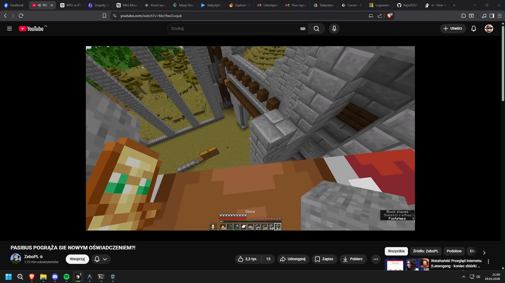

# EndoCode

EndoCode to desktopowa aplikacja Electron do pracy z lokalnym agentem kodującym (GGUF + llama.cpp), z naciskiem na:
- szybki workflow patch-first,
- transparentny podglad krokow agenta,
- lokalne narzedzia i lokalne pliki.

## Podglad aplikacji



## Co potrafi

- Chat i tryb agentowy (planowanie -> narzedzia -> final)
- Praca na plikach: odczyt, zapis, patchowanie, diff i historia undo/redo
- Integracja z lokalnym runtime (`llama-server`)
- Integracje modeli przez API: OpenAI, Claude, OpenRouter i DeepSeek
- Jawne przełączniki pamięci: ogólna pamięć robocza i lekki kontekst między czatami
- Zarzadzanie modelami GGUF (biblioteka, pobieranie, anulowanie pobierania)
- Konfiguracja parametrow modelu z poziomu UI

## Struktura i wymagania

EndoCode zaklada projektowy layout katalogow w repo:

```text
EndoCode/
  app/
  config/
  models/
  runtime/
```

Najwazniejsze:
- konfiguracja modeli: `config/models.json`
- runtime lokalny: `runtime/llama-server.exe`

## Uruchomienie (dev)

```powershell
cd app
npm install
npm start
```

## Build EXE

```powershell
cd app
npm run dist
```

## Uwagi

- Zmiana aktywnego modelu restartuje lokalny serwer modelu.
- Aplikacja dziala lokalnie, wiec wydajnosc zalezy od CPU/GPU oraz ustawien runtime.
